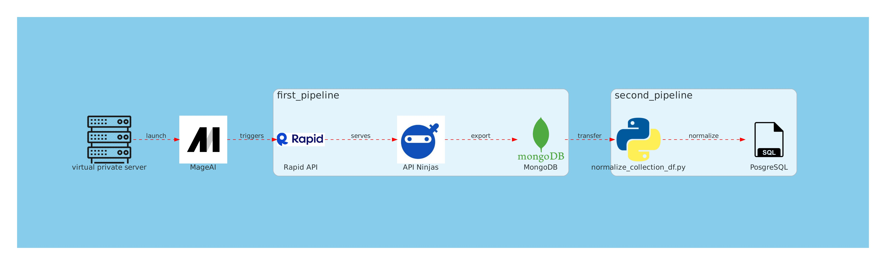

<center>

## Mage.AI Nutrition Analytics Pipeline

</center>

### Introduction

This project is designed to retrieve nutrition analytics data from the API-Ninjaz vendor hosted on the RapidAPI Hub. The data is processed through an ETL pipeline, and stored in a `PostgreSQL` database and `MongoDB` collection for further analysis and usage. Here, I highlight the potential impact of this project and delineate the dependencies required to establish the pipeline successfully on Mage.AI.



### Impact

1. **Real-time Nutrition Analytics**: Enabling rapid access to updated nutrition analytics data from API-Ninjaz to facilitate informed decision-making in the health and wellness sector.
2. **Data Normalization**: Transforming complex JSON API responses into relational data structures, making data querying and analysis streamlined.
3. **Resource Optimization**: Utilizing Docker containers and a VPS from SSDNodes to optimize resource usage and ensure scalability and performance.

### System Architecture

The following is the system architecture of the pipeline:

1. Data Retrieval: Retrieve data from API-Ninjaz through RapidAPI Hub.
2. Data Storage: Save the API responses in a MongoDB collection hosted as a Docker container on SSDNodes VPS.
3. ETL Process: Employ an ETL pipeline to extract data from MongoDB, transform it (data normalization), and load it into a PostgreSQL database as relational data frames via MageAI as an orchestration system.

### Dependencies

To set up and run this pipeline, the following dependencies are needed:

1. **RapidAPI Account**: Required to access the API-Ninjaz endpoint.
2. **Docker**: To containerize MongoDB and PostgreSQL databases.
3. **Python**: For scripting the Mage.AI pipeline. Required libraries include:
   - `pandas`: For data manipulation and analysis.
   - `requests`: To make API requests.
   - `pymongo`: To interact with MongoDB.
   - `sqlalchemy`: To interact with the PostgreSQL database.
   - `psycopg2-binary`: Exact dialect required to setup PostgreSQL engine via `sqlalchemy`.
   - `mage-ai`: Data orchestration platform used as a drop-in replacement for `Apache Airflow`.

### Setup & Installation

#### Step 1: Setup the Environment

- Setup an account with [RapidAPI](https://www.rapidapi.com/).
- Install [Docker](https://docs.docker.com/get-docker/) on the SSDNodes VPS.

#### Step 2: Configure MongoDB

- Pull the MongoDB Docker image and configure a container:
  ```sh
  docker pull mongo
  docker run --name mage-mongodb -d mongo
  ```

#### Step 3: Configure PostgreSQL

- Pull the PostgreSQL Docker image and configure a container:
  ```sh
  docker pull postgres
  docker run --name mage-postgres -d postgres
  ```

#### Step 4: Mage.AI Pipeline

- Clone this repository and navigate to the project directory.
- Install necessary Python packages:

```sh
pip install pandas requests pymongo sqlalchemy psycopg2-binary mage-ai
```

- Run the following command:

```sh
# Navigate to the directory of the pipeline
cd nutrition_api_project/data_pipeline/nutrition_api_project

# Starting Mage.AI server
mage start .
```

### Usage

Upon successful setup, you can run the Mage.AI pipeline to fetch nutrition analytics data, process it, and store it in the PostgreSQL database. You can query the data from PostgreSQL for analysis, reporting, or integration with other systems.
